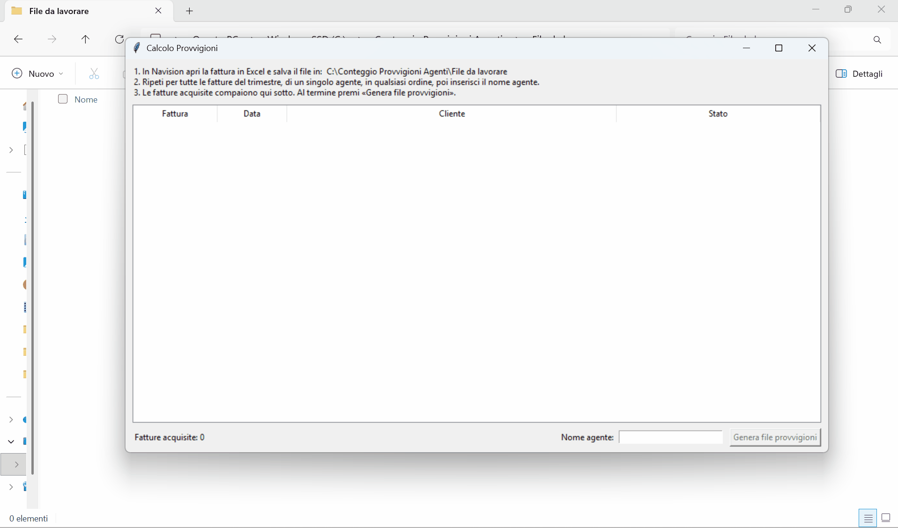

Nel presente README sono incluse le istruzioni da fornire ai miei colleghi non tecnici per installare e utilizzare l'applicazione
# provvigioni-navision
Il programma prende in input uno o più file Excel generati da Navision e li trasforma in un formato più leggibile e adatto al calcolo delle provvigioni.

Legge e modifica:
file Excel scaricati direttamente da Navision tramite Citrix;
file .xlsx copiati o spostati manualmente nella cartella di INBOX (purché siano sempre quelli generati da Navision).

## Installazione (una sola volta, per ogni PC)

1. Installa Python 3.10 o versioni seguenti da python.org con il launcher `py`
2. Copia la cartella del progetto sul PC.
2. Apri PowerShell nella cartella del progetto ed esegui uno dopo l'altro i seguenti comandi:

py -m venv .venv
.venv\Scripts\pip install -e

3. Fai doppio clic su `crea_collegamento.bat` poi segui le istruzioni.

   Vedrai ora sul desktop "Generatore Excel provvigioni" con la sua icona (simbolo € bianco su sfondo verde).

Da quel momento l'app si avvia con doppio clic sul collegamento come ogni altra applicazione.

## Utilizzo

1. Avvia l'applicazione
2. Salva gli export Navision nella cartella indicata a schermo dall'applicazione, le fatture compariranno poi a schermo
2. Scrivi il nome dell'agente nel campo "Nome agente" (il pulsante si abilita solo quando c'è almeno una fattura).
3. Premi "Genera file provvigioni": viene creato un unico file `Provvigioni_<nome inserito>.xlsx` con tutte le fatture acquisite.

## Prima e dopo

| Prima                                    | Dopo                                |
|------------------------------------------|-------------------------------------|
|  |  |

## Crediti
Le GIF dimostrative sono state create con [ScreenToGif](https://www.screentogif.com) di Nicke Manarin.

